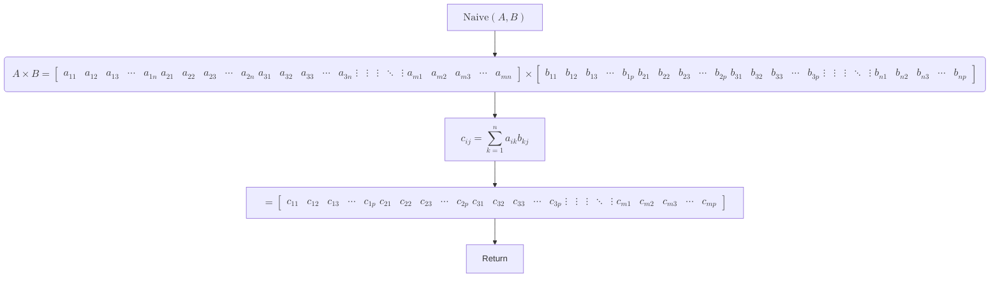
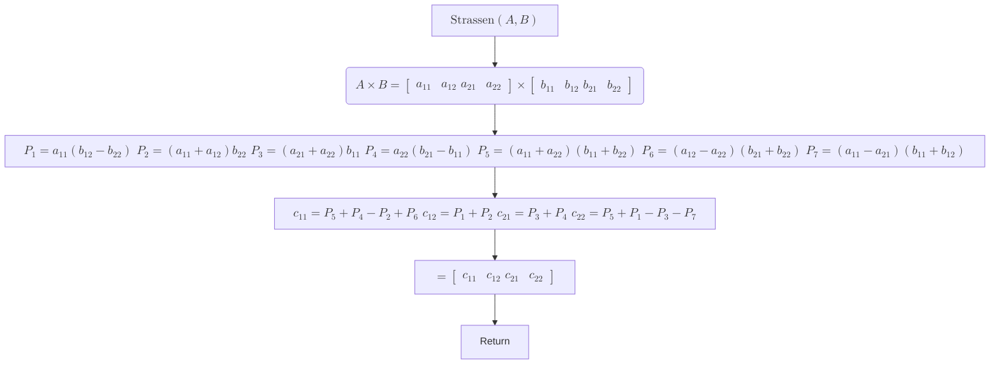
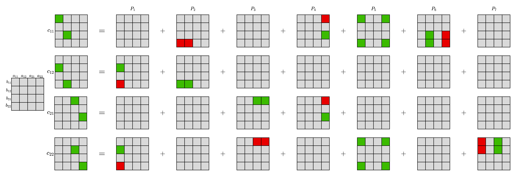

# Fast Matrix Multiplication

_to view the flowcharts properly, please use [FieryRMS/vscode-markdown-mermaid/v1.22.0](https://github.com/FieryRMS/vscode-markdown-mermaid/releases/tag/v1.22.0). As of 30/03/2024, mermaid does not reliably support mathmatical formula rendering for all platforms._

## Naive Matrix Multiplication



## The Strassen algorithm



### Tensor decomposition of Strassen algorithm


[image inspired from wiki](https://upload.wikimedia.org/wikipedia/commons/thumb/2/2e/Strassen_algorithm.svg/1200px-Strassen_algorithm.svg.png)


This method uses only 7 multiplications instead of 8. The Strassen algorithm is faster than the naive algorithm for large matrices. The time complexity of the Strassen algorithm is $O(n^{\log_2 7}) \approx O(n^{2.81})$ compared to the naive algorithm which has a time complexity of $O(n^3)$.

It has been proven that a 2x2 matrix multiplication cannot be done in fewer than 7 multiplications. The Strassen algorithm is optimal in this sense.

## Recursive Matrix Multiplication

For now, we assume that the matrix is a square matrix and the size of the matrix is a power of 2.

```mermaid
flowchart TD
    A(["$$\text{MUL}\left(A,B\right)$$"]) --> B["$$A\times B = \begin{bmatrix} a_{11} & a_{12} & \cdots & a_{1n} \\ a_{21} & a_{22} & \cdots & a_{2n} \\ \vdots & \vdots & \ddots & \vdots \\ a_{m1} & a_{m2} & \cdots & a_{mn} \end{bmatrix} \times \begin{bmatrix} b_{11} & b_{12} & \cdots & b_{1n} \\ b_{21} & b_{22} & \cdots & b_{2n} \\ \vdots & \vdots & \ddots & \vdots \\ b_{m1} & b_{m2} & \cdots & b_{mn} \end{bmatrix}$$"]
    B --> C{"Is the Matrix 2 x 2?"}
    C -- No --> D{{"Partition the Matrix"}}
    D --> E["$$A \times B = \left[ \begin{array}{c|c} A_{11} & A_{12}  \\ \hline A_{21} & A_{22} \end{array} \right] \times \left[ \begin{array}{c|c} B_{11} & B_{12}  \\ \hline B_{21} & B_{22} \end{array} \right]$$"]
    E --> F["$$= \left[ \begin{array}{cc} A_{11}B_{11} + A_{12}B_{21} & A_{11}B_{12} + A_{12}B_{22} \\ A_{21}B_{11} + A_{22}B_{21} & A_{21}B_{12} + A_{22}B_{22} \end{array} \right]$$"]
    F --> G["$$= \left[ \begin{array}{cc} \text{MUL}\left(A_{11},B_{11}\right) + \text{MUL}\left(A_{12},B_{21}\right) & \text{MUL}\left(A_{11},B_{12}\right) + \text{MUL}\left(A_{12},B_{22}\right) \\ \text{MUL}\left(A_{21},B_{11}\right) + \text{MUL}\left(A_{22},B_{21}\right) & \text{MUL}\left(A_{21},B_{12}\right) + \text{MUL}\left(A_{22},B_{22}\right) \end{array} \right]$$"]
    G --> H(["Return"])
    C -- Yes --> I[["$$\text{Strassen}\left(A,B\right)$$"]]
    I --> J(["Return"])
```
